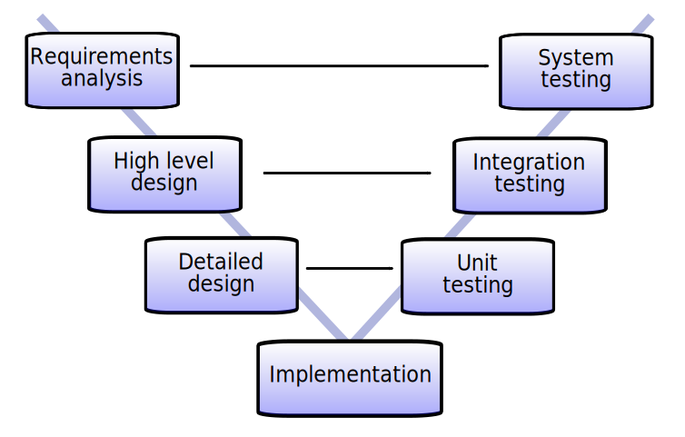

# 4. 4주차

* JPA 실습

## 4-1. 연관 관계

* JDBC로 시작해 2가지로 나뉨
    * SQL Mapper
      * Spring JDBC
      * myBatis
    * OR Mapper
      * JPA - Spring Data JPA
    * 둘다 JDBC를 사용함
* ```@JoinColumn```을 소개
    * ```name```이 있었지만, ```foreignKey = @ForeignKey(name = "")```이 없어 FK 에 대한 소개가 있으면 더 좋을듯
* 컬럼 타입은 Wrapper형으로
    * 설명은 없었지만, 내 생각으로 얘기하면..
    * Wrapper 타입 (Long, Double)을 써야만 **0과 null을 구분**할 수 있다.
    * primitive 타입 (long, double)을 쓰게 되면 **null은 0이 된다**
* 만약 ```@OneToMany```에 ```@JoinColumn```을 쓰면?
    * 자식 테이블에 컬럼이 반영됨
    * 다만, 내 생각엔 좋은 방법은 아닌것 같음
    * 자식 엔티티에 표기되어야 좀 더 직관적이 된다고 생각
* ```@OneToMany```는 잘 안쓴다
    * **자식들을 한번에 가져올 수 있기 때문에**, 위험함
* 복합키
  * ```@EmbeddedId```: 사용하는쪽에서 선언
  * ```@Embeddable```: 복합키 클래스에서 선언
  * 다만 쓸 일이 많지 않음
  * ```@ID Long id```가 대부분 무난한 선택
  * 혹시나 레거시가 복합키로 되어있다면 선택할 것

## 4-2. Repository

V Model



구현 (Implementation) 을 기준으로 전 / 후 단계로 나뉨

* ```@Query```
    * 안에서 사용되는 쿼리는 DB SQL이 아님
    * JPQL임
* N+1 문제
    * [해결책 참고](https://jojoldu.tistory.com/165)
  
## 4-3. 실습

* 다 대 다
    * 테이블은 다대다를 표현할수 없음
    * 그래서 매핑 테이블을 중앙에 두고 사용함
    * user <-> user_role <-> role
    * 여기서 user_role이 매핑테이블
* data.sql
    * 어플리케이션이 시작할때 실행하고 싶은 data insert SQL 모음
    * 

## 4-4. Spring Security

* 기본 id와 암호를 변경하는 방법
    * spring.security.user.name / password로 지정 가능
* 인증
    * 가입된 유저가 맞는지 확인
    * UserDetailsService
      * DB를 뒤져 해당 사용자의 UserDetails를 가져옴
    * UserDetails
      * id, password, 권한을 가지고 있음
* 인가
    * URL 마다의 접근 권한 관리
    * ```configure(WebSecurity web)```
        * 아예 **인가처리를 하지 않는** URL 설정
        * image, css, js 등
    * ```configure(HttpSecurity http)```
        * 인가 설정
        * URL별 권한 관리
    * ```headers().frameOptions().disable()```
        * h2를 사용하기 위해 설정
    * ```csrf().ignoringAntMatchers("/**")```
        * h2를 위해 disable
